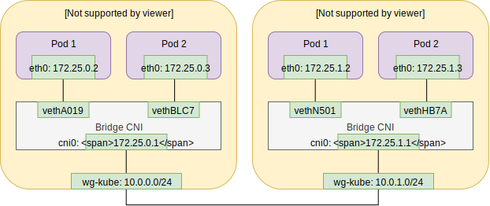

# WireGuard controller

The [WireGuard](https://www.wireguard.com/) controller is a flannel like pod network solution.
Inter node communication is being done using [WireGuard](https://www.wireguard.com/)

## Network



## Install

```bash
kubectl apply -f daemonset.yaml
```

The DaemonSet will require* WireGuard to be installed on the host.
If the node uses Ubuntu 18.04, WireGuard will be installed automatically.

## Building

```bash
go build github.com/mrincompetent/wireguard-controller/cmd/controller
sudo podman build -t quay.io/mrincompetent/wireguard-controller:v0.0.0-dev1 .
sudo podman push quay.io/mrincompetent/wireguard-controller:v0.0.0-dev1
```

## FAQ

> How can i configure the VPN to integrate other clusters?

You can't. This controller focuses on simplicity.

> Why another WireGuard CNI solution?

I was curious on how the pod networking works.

> Is this production ready?

No.

> Is this secure?

Probably not.
